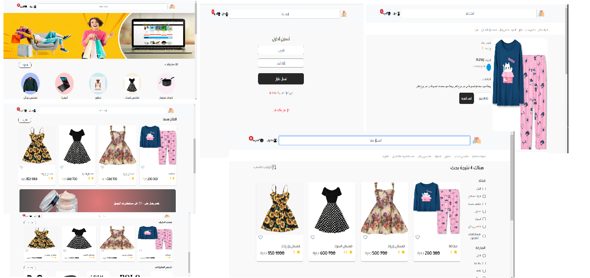

# Click Market

## Overview

This project is a feature-rich e-commerce platform designed to provide a seamless shopping experience for users while offering comprehensive management tools for administrators. It caters to both casual visitors and registered users, with functionalities tailored to enhance usability and efficiency.

[Watch the video on Google Drive](https://drive.google.com/drive/folders/1HhdkyhEhhW5VfZw6Zq1lnmbKzPDOkY3s?usp=sharing)

## Features

### General Features

- **Browsing and Searching:**
  - Visitors can freely explore the full range of products and search for specific items without needing to log in.

### User-Specific Features

- **User Authentication:**
  - Users must create an account and log in to access advanced functionalities, including:
    - Adding products to favorites.
    - Adding products to the shopping cart.
    - Placing orders and completing purchases.
- **Order Management:**
  - Track the status of current orders.
  - View a detailed history of all previous purchases.

### Admin Dashboard

The platform includes a robust admin dashboard to facilitate effective management and maintenance of the website. Key features include:

- **Order Management:**

  - View and manage all user orders.
  - Update the status of orders in real time.

- **Product Management:**

  - Add new products with detailed descriptions, images, and pricing.
  - Edit existing product details.
  - Delete outdated or unavailable products.

- **Category Management:**
  - Create and organize categories and subcategories.
  - Manage product brands to ensure efficient product categorization.

## Technologies Used

- **Frontend:**

  - React for building dynamic user interfaces.
  - React Bootstrap for styling and responsive design.
  - Redux for state management.

- **Backend:**

  - Node.js for server-side logic.
  - MongoDB for database management.

- **Authentication:**
  - Secure login system to protect user accounts.

## Getting Started

1. **Clone the Repository:**
   ```bash
   git clone
   ```
2. **Install Dependencies:**
   ```bash
   npm install
   ```
3. **Run the Application:**
   ```bash
   npm start
   ```
4. **Access the Admin Dashboard:**
   Use the designated admin credentials to log in and manage the platform.

---

## Project Screenshots

### Pages Screenshot



---

## Future Enhancements

- Integration with multiple payment gateways.
- Real-time notifications for users regarding order updates.
- Advanced analytics for the admin dashboard to monitor sales and user activity.

## Contributing

Contributions are welcome! Please fork the repository and submit a pull request with detailed explanations of your changes.

---

This project is designed to blend user-friendly shopping experiences with powerful admin tools, ensuring a robust and scalable e-commerce solution.
